# Topic Modeling Recipes

A reference collection of workflows, investigations, and methodological guides for unsupervised thematic analysis of large text corpora.

Built from real-world experience applying topic modelling across social media, mainstream media, and multilingual research corpora. The approach is generic to any textual data — social and mainstream media are the primary applied domains, not the scope.

Documents are self-contained. If you already know topic modelling, go directly to the section you need. Cross-references are provided throughout for deeper context.

---

## Pipeline Overview

```mermaid
flowchart TD
    A([Start: New Project]) --> B

    B["📋 Data Collection\ndocs/data-collection"]
    B --> C{Data scope\nfinalised?}
    C -->|No — scope\nstill open| B
    C -->|Yes| D

    D["⚙️ Preprocessing\ndocs/workflow"]
    D --> E{Multilingual\ndata?}
    E -->|Yes| F["🌐 Translation decision\ndocs/translation"]
    E -->|No| G
    F --> G

    G["🔢 Embedding extraction\ndocs/workflow"]
    G --> H{Large\ndataset?}
    H -->|Yes| I["📊 Sampling strategy\ndocs/sampling"]
    H -->|No| J
    I --> J

    J["🗂️ Topic modelling\nUMAP + HDBSCAN"]
    J --> K{Predefined\ncategories?}
    K -->|Yes| L["🎯 Guided topic modelling\ndocs/guided"]
    K -->|No| M
    L --> M

    M{-1 cluster\nsignificant?}
    M -->|Yes| N["🔍 Outlier mitigation\ndocs/outliers"]
    M -->|No| O
    N --> O

    O["✏️ Thematic allocation\n& annotation\ndocs/annotation"]
    O --> P{Topics\nheterogeneous?}
    P -->|Yes| Q["🔁 Layered modelling\ndocs/layered"]
    P -->|No| R
    Q --> R

    R["✅ Evaluation\ndocs/evaluation"]
    R --> S{Performance\nacceptable?}
    S -->|No — revise\nallocation| O
    S -->|Yes| T([Analysis & Reporting])

    classDef process fill:#ffffff,stroke:#1B1A18,stroke-width:1.5px,color:#1B1A18
    classDef decision fill:#C8A876,stroke:#1B1A18,stroke-width:1.5px,color:#1B1A18,font-weight:bold
    classDef terminal fill:#1B1A18,stroke:#1B1A18,color:#ffffff,stroke-width:1.5px
    classDef data fill:#F4EFE5,stroke:#1B1A18,stroke-width:1.5px,color:#1B1A18

    class B,D,G,I,J,L,N,O,Q,R process
    class C,E,H,K,M,P,S decision
    class A,T terminal
```



---

## Contents

| Section | What it covers |
|---|---|
| [Data Collection](docs/data-collection/) | Why data collection decisions are unusually consequential in topic modelling — and what to lock in before the model runs |
| [Core Workflow](docs/workflow/) | The five-stage pipeline: preprocessing, embedding, UMAP + HDBSCAN, thematic allocation, evaluation |
| [Granular Annotation](docs/annotation/) | Entropy-based, proportional sampling annotation — replacing fixed-sample approaches with theoretically grounded stopping criteria |
| [Sampling & Extrapolation](docs/sampling/) | The UMAP extrapolation problem and how to handle datasets too large to model in full |
| [Outlier Mitigation](docs/outliers/) | What to do with HDBSCAN's -1 cluster — soft clustering, k-means, and KNN-based classification at scale |
| [Layered Topic Modelling](docs/layered/) | Iterative modelling passes for heterogeneous or complex corpora |
| [Guided Topic Modelling](docs/guided/) | Contrastive learning to steer the embedding space toward predefined analytical objectives |
| [Evaluation](docs/evaluation/) | Review vs blind evaluation, stratified vs general sampling, and a hybrid approach |
| [Translation](docs/translation/) | Source text vs translated text for clustering — empirical comparison and when each approach is appropriate |

**Checklists**
- [Topic Modelling Checklist](checklists/topic-modeling.md) — stage-by-stage checklist for starting a new project

---

## How to navigate

### Starting a new project
Read the checklist first: [`checklists/topic-modeling.md`](checklists/topic-modeling.md)

Then read in order:
1. [Data Collection](docs/data-collection/) — lock in your data scope before anything else; changes after the model runs are expensive
2. [Core Workflow](docs/workflow/) — understand the full pipeline before running it

### You have a -1 outlier problem
→ [`docs/outliers/`](docs/outliers/)

The -1 cluster typically captures 40–60% of data and is not noise — it is fringe content on the periphery of core topics. Three approaches are covered: soft clustering using HDBSCAN membership vectors, k-means applied to the -1 cluster, and KNN-based classification via [`semantic-knn`](https://github.com/ay94/semantic-knn) for large-scale corpus labelling.

### You are working on a large dataset
→ [`docs/sampling/`](docs/sampling/) — understand the UMAP extrapolation problem before training on a sample and applying to the full corpus

### You want to avoid mistakes from previous projects
→ [`docs/workflow/`](docs/workflow/) — the design decisions section covers data collection timing, UMAP extrapolation on large datasets, and parameter tuning pitfalls

### Your data is multilingual
→ [`docs/translation/`](docs/translation/) — covers whether to cluster on source text or translated text, with empirical findings on topic homogeneity across setups

### You have predefined categories to find
→ [`docs/guided/`](docs/guided/) — contrastive learning to steer the embedding space toward your analytical framework rather than discovering whatever emerges

### Your topics are too broad or heterogeneous
→ [`docs/layered/`](docs/layered/) — apply successive modelling layers to progressively refine structure without predefined classifiers

### You need to evaluate thematic allocation rigorously
→ [`docs/evaluation/`](docs/evaluation/) — review vs blind evaluation, stratified vs general sampling, and a hybrid approach that balances bias control with efficiency

### You need a more rigorous annotation approach
→ [`docs/annotation/`](docs/annotation/) — entropy-based stopping criteria, proportional sampling, per-message description

---

## Related libraries

| Library | Description |
|---|---|
| [`multilingual-topic-modeling`](https://github.com/ay94/multilingual-topic-modeling) | Full pipeline toolkit — embedding, UMAP/HDBSCAN, SetFit-guided refinement, translation, preprocessing, analysis |
| [`semantic-knn`](https://github.com/ay94/semantic-knn) | KNN classification via ChromaDB for large-scale corpus labelling using annotated exemplar embeddings |

---

## Citation

If you use or reference this work, please cite:

```bibtex
@misc{younes2024topicmodelingrecipes,
  author       = {Younes, Ahmed},
  title        = {Topic Modeling Recipes: Workflows and Methodological Guides for Unsupervised Thematic Analysis},
  year         = {2024},
  publisher    = {GitHub},
  url          = {https://github.com/ay94/topic-modeling-recipes}
}
```

---

## License

Documentation and written guides are licensed under [CC BY 4.0](https://creativecommons.org/licenses/by/4.0/).
Code and notebooks are licensed under the [MIT License](LICENSE).

---

## Status

Work in progress — sections are being added iteratively. Each section includes a written guide and, where applicable, a worked example notebook.
