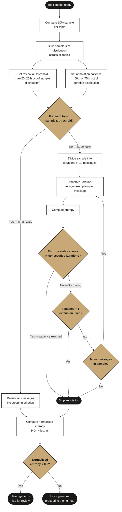

# Granular Annotation Scheme

As described in [`docs/workflow/`](../workflow/), topic modelling produces a set of topics via embedding, UMAP, and HDBSCAN. The annotation phase follows: each topic is sampled, described, and organised into a topic theme map. This document covers the annotation phase specifically — how to conduct it rigorously.

> **Cross-references:**
> - Core pipeline context: [`docs/workflow/`](../workflow/)
> - Evaluation context: [`docs/evaluation/`](../evaluation/)

---

## Overview

The standard annotation method fixes the sample size per topic based on project type: **5 messages** for exploratory projects focused on qualitative analysis, and **10 messages** for quantitative projects where greater robustness is needed. The annotator reviews that sample and determines the topic's dominant theme by majority membership — if 7 out of 10 sampled messages discuss football, the topic is about football (or 4 out of 5 in the 5-message case). Topics are then organised into themes and sub-themes to produce a topic theme map. Both conventions proved broadly effective but carry the same core limitation.

This approach is methodologically hard to justify: there is no statistical basis for choosing 10 or 5 in the first place — no statistical indication that either number is sufficient or representative for any given topic. The choice was validated through project experience, not derived from the data. A further consequence is that the same fixed sample is applied regardless of topic size: a 30-message topic and a 3,000-message topic receive identical annotation attention.

The **granular annotation scheme** replaces this with:

- **Proportional sampling** — 10% of messages per topic rather than a fixed count
- **Per-message annotation** — each sampled message receives an individual description; the most frequent description represents the topic
- **Entropy-based stopping criteria** — measures description diversity to determine when a topic is sufficiently characterised, without reviewing the full sample
- **Annotation patience** — a hyperparameter that bounds the number of annotation iterations before a decision is made

---

## The Standard Approach — What It Replaces

The standard approach takes a fixed sample of messages from each topic, produces a single summary description of the topic, and organises topics into a theme map. For exploratory projects the sample is typically 5 messages; for quantitative projects with thematic allocation and evaluation, 10 messages became the established convention across multiple projects.

### Procedure

1. Select a random sample of messages from each topic.
2. Review the sample to describe the topic.
3. Organise the topics into sub-themes.
4. Group the sub-themes into overarching themes.

The result is a topic theme map used for analysis or evaluation. Because the method is sample-based, the description of each topic relies on a small fraction of its messages. The evaluation phase then tests whether that description generalises to all messages within the topic.

### Pros

- Quick, with predictable time estimates — the fixed sample size makes annotation scheduling straightforward.
- In most projects, 10 messages per topic provided satisfactory thematic insights and acceptable evaluation performance.
- Particularly useful in exploratory projects to identify specific content quickly.
- Enables qualitative analysis of detailed content — for example, zero-shot classification based on sub-themes or patterns identified in the theme map.

### Cons

- **Performance degrades at granular levels** — the more granular the sub-theme breakdown, the lower the thematic allocation performance. Fixed-sample descriptions are approximations that become less reliable as analytical resolution increases.
- **Methodologically hard to justify** — there is no statistical basis for choosing 5 or 10 messages. Neither number is derived from the data or from any statistical indication of what sample size is sufficient or representative. The choice was validated through project experience alone, which is difficult to defend when challenged. A further consequence is that the same fixed count is applied regardless of topic size — a 30-message topic and a 3,000-message topic receive identical annotation attention.
- **Evaluation requires multiple iterations** — if the initial theme map produces poor evaluation performance, the annotation must be revised and re-evaluated, sometimes multiple times.
- **Noise is hard to handle** — identifying and filtering irrelevant or noisy topics is difficult. The usual responses (discard or apply keyword filters) each introduce additional methodological complexity.
- **Description is an approximation** — because the sample is fixed and small, the topic description is based on an incomplete picture. Allocating sub-themes and themes requires domain knowledge to fill in what the topic might be discussing beyond the sample.

---

## Proposed Approach — Granular Annotation

The granular scheme addresses these limitations by adjusting the sampling strategy, changing the annotation unit from topic to message, and introducing measurable stopping criteria.

### Topic Homogeneity

The primary aim of annotation is to understand and quantify the narratives within the data by providing precise descriptions for each topic. Because the method depends on sampling from each topic, those samples must accurately represent the broader discussion — a property called **topic homogeneity**, where most messages in a topic discuss the same or closely related subjects. Homogeneity also needs to align with the analytical goals of the project. In a project analysing sentiments about a holiday company, for example, each topic should ideally reflect a specific, consistent sentiment about the company rather than mixing positive and negative responses.

A frequent pattern is topics built around a key 'essence' — a shared entity or surface feature such as mentions of the company name. This emerges from UMAP's summarisation of message semantics and HDBSCAN's grouping of messages based on that summary. The result can be topics that are content-homogeneous (all mentioning the company) but analytically mixed, containing both positive and negative sentiment. Despite offering some insight, these topics pose annotation challenges. Practical experience shows that clients find a clear positive or negative categorisation more useful than a neutral one, yet the mixed nature of these topics makes that categorisation difficult. Annotators typically treat them as heterogeneous and exclude them from further analysis.

Topic homogeneity is therefore a necessary but not sufficient condition: a topic that is uniform in content but analytically mixed is still problematic, even if it is internally coherent.

---

## Granular Annotation Procedure

The key distinctions of the granular approach lie in three areas: the **sampling strategy**, the **annotation process**, and the **stopping criteria**.



---

### Sampling Strategy

Instead of a fixed number of messages per topic, the granular scheme samples a **fixed proportion — 10% of messages per topic**.

This proportional method is more methodologically justifiable: the sample size scales with the topic's actual size, ensuring that larger topics receive proportionally more annotation attention. A topic of 1,000 messages yields a sample of 100; a topic of 30 messages yields a sample of 3.

The trade-off is increased annotation workload for large topics. The stopping criteria (described below) are designed specifically to manage this workload without sacrificing annotation quality.

---

### Annotation Strategy

The annotation unit changes from the topic to the individual message. Rather than producing a single summary description for the topic as a whole, annotators **review each sampled message individually and assign a specific description** based on that message's content.

Key rules:

- Each message is linked to exactly one description.
- A single description may apply to multiple messages if they share similar content and align with that description's definition.
- The description that appears most frequently across all messages in the sample is designated as the **overall topic description**.

The key advantage over the standard approach is **traceability**. Previously, reviewing 10 messages and producing a single summary left no record of which messages contributed to it — re-evaluation meant re-reviewing the sample from scratch. Here, every message in the sample is linked to a specific description, so the full annotation can be audited and revisited at the message level.

This granularity also produces a richer understanding of the topic. Because annotators engage with individual messages rather than inferring a summary from a small window, the descriptions reflect what the topic actually contains. This pays off in several ways:

- **Evaluation** — precise per-message descriptions reduce the number of evaluation iterations needed; when performance is poor, it is clear which messages drove which description, making failure diagnosis more straightforward.
- **Decision-making** — individual messages can be used to steer topics in different directions: identifying sub-narratives, seeding guided models, or filtering specific content.
- **Example selection** — annotated messages serve directly as labelled examples for downstream tasks such as classification, without requiring a separate labelling step.

The workload is higher than the standard approach, particularly for large topics. The stopping criteria below are designed to bound this workload.

---

### Stopping Criteria

The threshold between "review all" and "use entropy stopping" is set from the data rather than fixed in advance. Compute the 10% sample size for every topic in the model and take the **25th percentile** of that distribution. Topics at or below this threshold are reviewed in full; topics above it use entropy-based early stopping.

There is also a hard floor: early stopping requires at least two consecutive entropy values to compare — one from iteration 1, one from iteration 2. A sample of fewer than 20 messages yields only one iteration of 10 messages, making the stability check impossible. If the 25th percentile of the sample distribution falls below 20, the threshold defaults to 20.

In summary: the cutoff is **max(20, 25th percentile of 10% sample distribution)**. Topics at or below the cutoff are reviewed in full. Topics above it use entropy-based stopping.

For topics above the threshold, the stopping criterion is based on **entropy** — a measure of the variety or diversity in the descriptions assigned so far. High entropy indicates a heterogeneous topic (many different descriptions); low entropy indicates a homogeneous topic (one or a few descriptions dominate).

#### Entropy Calculation

For a given topic, compute the probability distribution of descriptions across the annotated messages. Entropy is then:

```
H(X) = -∑ p(x) log₂ p(x)
```

Where X is a discrete random variable representing the annotation, with possible outcomes x, and p(x) denotes the probability of each description within the topic.

Entropy has two important boundary values:

- **Minimum entropy** = 0 (all messages have the same description — perfectly homogeneous)
- **Maximum entropy** = log₂(n), where n is the number of distinct descriptions for the topic

A topic is deemed **homogeneous** if its entropy falls below 50% of the maximum (an empirical threshold; 75% can be used in some contexts). A topic is deemed **heterogeneous** if entropy exceeds the threshold.

Because the raw entropy value depends on the number of distinct descriptions and may not be intuitive across topics of different sizes, it is often more useful to compute **normalised entropy**:

```
Normalised Entropy = H(X) / log₂(n)
```

Normalised entropy is bounded [0, 1]. A normalised entropy greater than 0.5 indicates heterogeneity; lower values indicate homogeneity.

---

### Early Stopping

For large samples, annotating the full 10% sample per topic is often unnecessary — the entropy signal stabilises before the full sample is reviewed. The early stopping mechanism borrows from machine learning: annotation is divided into iterations of 10 messages each, and entropy is recalculated after each iteration.

**If entropy stabilises** — whether high or low — after a predetermined number of iterations, further annotation is unlikely to change the conclusion. The process stops.

**If entropy fluctuates**, the process extends by one additional iteration beyond the patience limit before stopping.

Example: a topic of 1,000 messages yields a 100-message sample, divided into 10 iterations of 10 messages each. If entropy stabilises after 5 iterations (50 messages reviewed), there is no need to continue to iteration 10.

---

### Annotation Patience

**Annotation patience** is the key hyperparameter that defines how many consecutive stable-entropy iterations trigger early stopping.

Its initial value is derived from the **distribution of annotation iterations across all topics in the model**. For each topic, compute the 10% sample size and divide by 10 to get the number of 10-message iterations that topic would yield. This gives a distribution of iteration counts across all topics. Patience is then set to a percentile of that distribution:

- **50th percentile (median)** — suitable for projects with tighter time or budget constraints. Annotators stop earlier on average; some heterogeneity may go undetected in larger topics.
- **75th percentile** — suitable for projects where thoroughness is the priority and more annotation time is available. Annotators review more of each topic before stopping.

The choice of percentile is a project-level decision made before annotation begins, based on available time and the required level of analytical confidence.

**Example:** a model with 100 topics. For each topic, compute its 10% sample and divide by 10 to get iteration count. If the 75th percentile of that distribution is 6, set patience = 6 — meaning annotation stops after 6 consecutive stable-entropy iterations (60 messages reviewed per topic at most).

Annotation patience is not fixed for the full annotation run. As annotation proceeds and the homogeneity landscape of the model becomes clearer, patience can be progressively reduced for remaining topics.

---

## Summary

### Sampling Procedure

1. Sample **10%** of messages from each topic.
2. Compute the 25th percentile of the resulting sample size distribution. Set the review-all threshold to max(20, 25th percentile).
3. For samples at or below the threshold, treat the entire sample as one iteration. For samples above the threshold, divide into **iterations of 10 messages**.
4. Record two pieces of information for each message: the message itself, and its assigned description along with the definition of that description.

### Annotation Procedure

1. Review each message in the sample and assign a description based on its content.
2. Each message receives exactly one description; a single description may apply to multiple messages if they share content and align with the definition.
3. The most frequently occurring description across all messages in the sample is designated as the **overall topic description**.

### Stopping Criteria

**Small samples (at or below threshold):** Review all messages. No stopping criterion applied. The threshold is max(20, 25th percentile of 10% sample distribution) — the floor of 20 exists because early stopping requires at least two iterations to compare entropy values.

**Larger samples (above threshold):**

1. Calculate entropy after each iteration of 10 messages.
2. Apply early stopping based on annotation patience:
   - If entropy **stabilises** across consecutive iterations, stop after reaching the patience limit.
   - If entropy **fluctuates**, extend by one additional iteration beyond the patience limit before stopping.
3. Final topic classification based on entropy:
   - **Heterogeneous** — entropy exceeds 50% of maximum possible entropy, or normalised entropy > 0.5.
   - **Homogeneous** — entropy is below threshold.

---

## Advantages

### Enhanced topic analysis

- Enables filtering of outlier messages within a topic (for example, economically focused messages surfacing within a sports topic) because descriptions are assigned at the message level.
- Per-message annotation provides a deeper understanding of each topic, supporting more precise categorisation into themes and sub-themes.

### Methodological robustness

- Proportional sampling is more defensible than a fixed sample: the sample size is justified by the topic's own message count.
- Entropy-based stopping criteria provide a measurable, empirical basis for deciding when sufficient data has been annotated — replacing intuitive judgements with a computable signal.

### Improved annotation process

- The annotation task is decomposed: annotators focus on one message at a time rather than needing to simultaneously assess homogeneity, analytical relevance, and description for the whole topic. Previous approaches required annotators to do all three at once from a 10-message window.
- Although initial annotation takes longer, the evaluation phase becomes more straightforward — the per-message descriptions reduce the number of evaluation iterations required and make failure diagnosis easier.

### Better understanding of topics

- Annotators develop richer insight into topic content than previous methods allow.
- The granular per-message descriptions provide the structure needed to apply text classification methods — for example, supervised classifiers can be trained directly from the annotated descriptions without needing to infer what the topic discusses as the process unfolds.

### Flexibility in data integration

- Per-message descriptions make it easier to merge annotation outputs from different topic models. Topics from different models can be annotated independently and merged based on shared descriptions, rather than requiring manual reconciliation of topic-level summaries.

---

## Limitations

### Increased annotation time

Annotating each message individually is more time-consuming than reviewing a 10-message topic summary. The early stopping mechanism mitigates but does not eliminate this cost.

### Hyperparameter validation

The key hyperparameters — sample proportion, annotation patience, and the entropy threshold — are empirically motivated but have not been formally validated across a wide range of project types and corpus sizes. Optimal values may vary across different corpus characteristics and project goals.

Over time, as more annotation data is accumulated, there is potential to develop a regression model that learns the relationship between entropy and labelling accuracy. Such a model could predict the expected accuracy of new topics based on their entropy before full annotation is completed — enabling earlier decisions about whether a topic warrants further review. However, this requires the scheme to be applied repeatedly across multiple projects so that sufficient training data accumulates.

### Representativeness questions

The 10% sampling ratio is more methodologically defensible than a fixed count, but representativeness can still be questioned for very large topics where 10% is a substantial number of messages, or very small topics where 10% is fewer than 3 messages. This calls for ongoing evaluation of whether the chosen ratio accurately reflects the broader topic, and possibly refinement of the sampling strategy as more projects are completed.

### Stopping criteria need further development

The entropy-based stopping criterion, particularly for samples that fluctuate around the threshold, may require additional criteria to ensure both efficiency and accuracy. Stopping too early risks misclassifying a borderline topic; stopping too late wastes annotation effort. The silhouette score applied to the full topic dataset is one candidate for a complementary signal — it provides a cluster-level homogeneity measure independent of the annotation labels and could confirm or challenge entropy-based conclusions.

### Requires interactive tooling

Effective implementation requires annotators to visually interact with message-level examples and monitor entropy values in real time across iterations. The annotation process as described requires purpose-built tooling — annotators need to see messages iteration by iteration, track entropy as it evolves, and act on the patience signal when it is reached. This is not straightforward to implement in a general-purpose spreadsheet.

---

## Future Work

**Sampling strategy** — develop a statistical framework to rigorously test whether the 10% sample is representative of the full topic. Explore predictive models that determine the most effective sampling ratio as a function of topic size and corpus characteristics — this would involve analysing annotation data accumulated across projects to identify patterns and correlations between topic size and the sampling ratio that produces reliable descriptions.

**Stopping criteria** — integrate additional stopping signals alongside entropy. The silhouette score applied to the full topic dataset is a natural candidate: it provides a cluster-level homogeneity measure that is independent of the annotation labels and could confirm or challenge entropy-based conclusions.

**Interactive annotation tool** — develop tooling that displays message samples iteration-by-iteration, computes entropy in real time after each iteration, visualises entropy stability, and flags when the patience limit is reached. Keyword discovery features within the tool would support filtering of specific sub-narratives within a topic.

---

## Checklist

- [ ] Topic model run and topics identified
- [ ] 10% sample drawn per topic
- [ ] Review-all threshold computed: max(20, 25th percentile of 10% sample distribution)
- [ ] Sample size classified: at or below threshold (review all) or above threshold (entropy stopping with iterations of 10)
- [ ] Annotation patience set based on topic size distribution
- [ ] Each message in the sample annotated with an individual description
- [ ] Entropy calculated after each iteration for large topics
- [ ] Early stopping applied: patience limit reached and entropy stable, or one extension applied for fluctuating entropy
- [ ] Final entropy / normalised entropy recorded per topic
- [ ] Topics classified as homogeneous or heterogeneous based on entropy threshold
- [ ] Dominant description identified (most frequent) per topic
- [ ] Topic theme map constructed from descriptions
- [ ] Heterogeneous topics flagged for review or exclusion before evaluation
