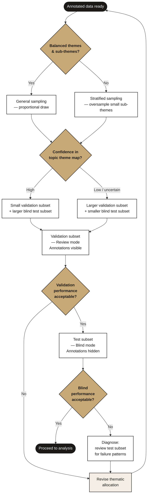

# Evaluation Framework

How to assess the performance of thematic allocation — what modes to use, when each is appropriate, and a hybrid approach that balances bias control with analytical efficiency.

> **Cross-references:**
> - Core pipeline context: [`docs/workflow/`](../workflow/)
> - Annotation context: [`docs/annotation/`](../annotation/)

---

## Evaluation Workflow

---

## Overview

The goal of the evaluation stage is to assess the performance of thematic allocation — confirming that messages are correctly assigned to their themes and sub-themes. Evaluation serves a dual purpose: it is both a performance measurement (precision and recall) and a review process that enables analysts to develop a comprehensive understanding of the data, identify stable thematic categories, and flag areas of noise in the annotations. This iterative process often surfaces labelling inconsistencies that require corrective action — a pattern observed consistently across projects.

---

## Evaluation Modes

Evaluation data can be presented to analysts in two ways.

### Review mode
Analysts are shown the topic model annotations alongside each message. They agree or disagree with each assignment. Because they can see the model's output, they immediately understand where the thematic breakdown is working and where it is noisy, and can identify what corrective action is needed. This was the standard approach across the majority of projects.

### Blind mode
Annotations are hidden. Analysts read the message and independently assign a theme and sub-theme. Their assignments are then compared against the model's. This eliminates anchoring bias — analysts cannot defer to the model's output.

The cost: if performance is low, analysts must go through the same sample two or three times — once to evaluate, then again to identify the specific misallocations, then again to address them. In review mode, problematic annotations are identified and understood in a single pass.

**The bias concern:** In practice, showing analysts the topic model annotations can influence their judgements — they are more likely to agree with the model's assignment than to flag it, inflating apparent precision. This is a known risk of review mode that should be weighed against its efficiency advantages.

---

## Sampling Strategies

Evaluation can be run at two hierarchical levels — **theme** and **sub-theme** — and with two sampling strategies.

### General sampling
Draws a representative sample proportional to the theme and sub-theme distribution in the full annotated dataset. Appropriate when themes are balanced — when no single theme dominates to the point that a proportional sample would underrepresent others. Produces a precision and recall estimate reflecting overall performance.

### Stratified sampling
Oversamples from specific themes or sub-themes — typically the smaller or less-represented ones. Appropriate when the analytical focus is on those underrepresented sub-themes, or when a balanced evaluation is needed for reporting purposes despite a skewed underlying distribution. Answers the question of whether the model performs consistently across the full thematic breakdown, not just well on the largest themes.

> **Note:** The choice of sampling strategy should be agreed before evaluation begins. Changing it after initial results have been produced makes it difficult to compare across evaluation rounds.

---

## The Tradeoff

| | Review mode | Blind mode |
|---|---|---|
| Bias risk | Higher — analyst may anchor to model output | Lower — independent judgement |
| Efficiency | Higher — issues identified in a single pass | Lower — may require multiple passes |
| Analytical insight | Higher — analyst understands failure modes immediately | Lower — requires additional review pass to diagnose |
| Best for | Projects with uncertainty about annotation robustness | Projects with high confidence in the topic theme map |

---

## Recommended Approach: Hybrid Evaluation

The proposed resolution combines the strengths of both modes by dividing the evaluation sample into two subsets.

**Step 1 — Validation subset (review mode)**
A portion of the sample is shown to analysts with annotations visible. This is the review pass — analysts check for labelling inconsistencies, identify noise, and build their understanding of the topic structure.

**Step 2 — Gate check**
If performance on the validation subset is satisfactory, this indicates the thematic breakdown is robust enough to proceed. If performance is low, corrective action is taken before continuing.

**Step 3 — Test subset (blind mode)**
The remaining portion is evaluated without annotations. This produces an unbiased precision and recall estimate at theme or sub-theme level.

This approach is more efficient than a fully blind evaluation because corrective actions are identified during the validation pass, concurrently with the evaluation — rather than requiring an additional pass after a low blind result.

**Key decision variable:** Analyst confidence in the topic theme map. If the map is clear and topics are well-characterised, the test subset can be proportionally larger. If there is uncertainty about annotation robustness, increase the validation subset before moving to blind.

---

## Metrics

| Metric | Formula |
|---|---|
| Precision | TP / (TP + FP) |
| Recall | TP / (TP + FN) |
| F1 | 2 × (Precision × Recall) / (Precision + Recall) |

Evaluation is conducted at the agreed hierarchical level — theme or sub-theme. Quantitative analysis claims should be limited to evaluated levels only: do not report sub-theme precision if evaluation was run at theme level.

> **Multiple label tolerance:** In some projects, analysts are permitted up to 3 label choices per message to capture inherent thematic overlap. Where this is used, it should be agreed and documented before evaluation begins, as it affects how precision and recall are calculated.

---

## When to Skip Evaluation

Exploratory projects focused on qualitative narrative discovery may not require quantitative evaluation if:
- Findings are presented transparently as qualitative observations
- No quantitative claims about theme volumes or model precision are made in the output

If quantitative claims appear in the output, evaluation is required regardless of project type.

---

## Checklist

- [ ] Evaluation mode agreed: review, blind, or hybrid
- [ ] Sampling strategy agreed: general or stratified
- [ ] Evaluation level agreed: theme or sub-theme
- [ ] Sample size sufficient for the chosen strategy
- [ ] Multiple label tolerance policy agreed if applicable
- [ ] Analysis claims limited to evaluated levels only
