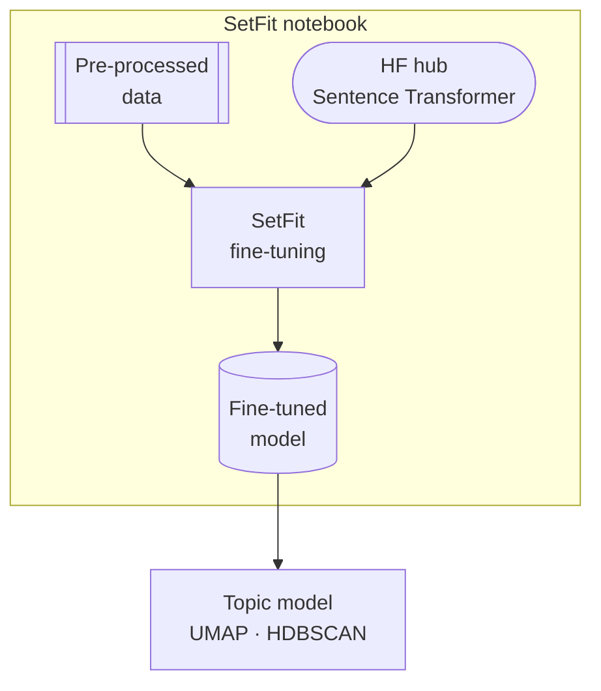
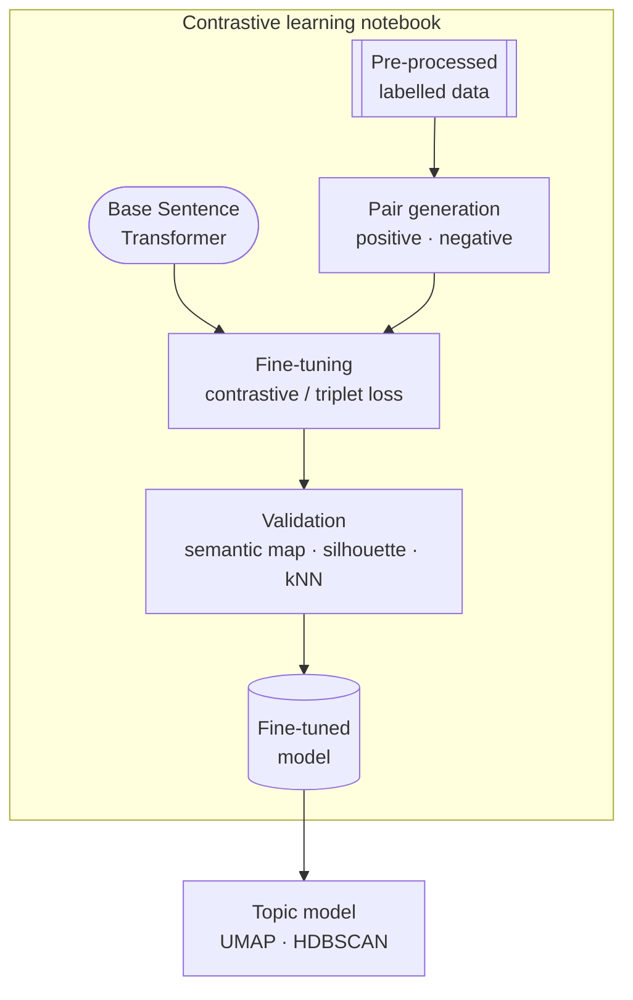
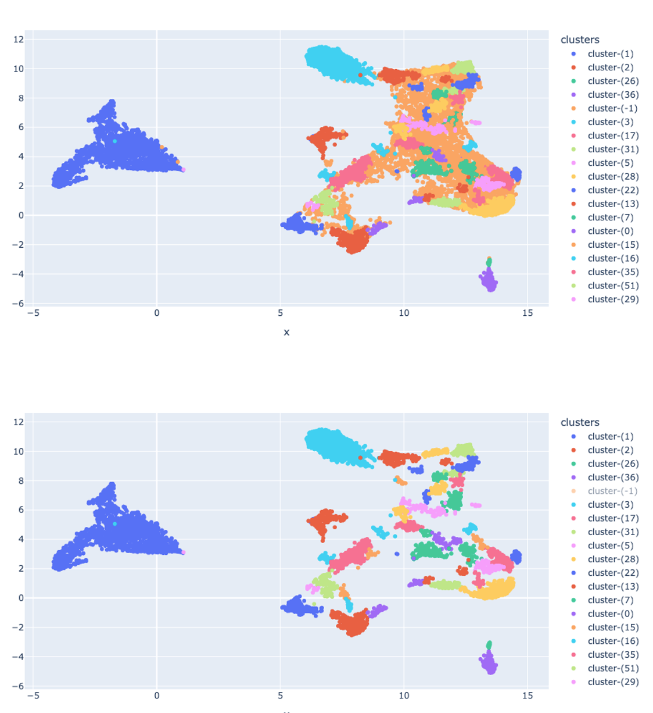

# Guided Topic Modelling

How to steer the embedding space toward analytically meaningful cluster boundaries — rather than accepting whatever structure emerges from the data.

> **Cross-references:**
> - Core pipeline context: [`docs/workflow/`](../workflow/)
> - Layered modelling: [`docs/layered/`](../layered/)

---

## The Problem

Traditional sentence transformers are trained for sentence similarity or paraphrasing tasks. They produce embeddings that reflect general semantic similarity — but general semantic similarity is not always what an analysis needs. Two messages can be semantically close (same topic, similar vocabulary) while being analytically distinct, or semantically distant while belonging to the same analytical category.

When HDBSCAN clusters these embeddings, it identifies density-based structure in the learned space. That structure reflects the model's training objective, not the analyst's framework. The result is clusters that are coherent from the model's perspective but misaligned with the analysis: merged clusters that should be separate, noisy clusters that absorb off-topic content, or a flat structure that fails to reflect a known thematic hierarchy.

Guided topic modelling addresses this by adjusting the embedding space itself — before clustering — so that the model's notion of similarity better matches the analyst's.

---

## The Approach

The core mechanism is contrastive learning: fine-tuning a sentence transformer using explicit positive and negative labels derived from cluster output or analyst annotation.

- **Positive pairs** — messages that belong together analytically (drawn from the same class or cluster)
- **Negative pairs** — messages that should be separated (drawn from different classes or clusters)

The model is trained to bring positives closer in the embedding space and push negatives apart. This reshapes the space so that subsequent UMAP reduction and HDBSCAN clustering produce boundaries that reflect the intended analytical distinctions rather than the model's defaults.

Two implementations are available depending on the use case. One approach is **SetFit** — a few-shot fine-tuning framework from HuggingFace (see the [SetFit library](https://github.com/huggingface/setfit)) that requires only a small number of labelled examples (typically 8–16 per class) drawn from existing cluster output. No large labelled dataset is required; the cluster output itself provides the training signal. A SetFit-based implementation is also available in the [`multilingual-topic-modeling`](https://github.com/ay94/multilingual-topic-modeling) library. The other approach is a **full contrastive learning pipeline** — training directly with contrastive or triplet loss on positive and negative pairs, with explicit control over pairing strategy, loss function, and evaluation. An implementation of this approach is available in [this repository](<!-- TODO: add repo link when published -->).

### Pairing strategies

**Default** — generates all pairwise combinations within each class up to a sample size cap, then pairs each positive with negatives from all other classes. Thorough but can be imbalanced when class sizes differ significantly.

**Stratified** — generates a fixed number of pairs with even representation across classes. Better when classes are unequal in size and a balanced training signal is needed.

### Loss functions

**Contrastive loss** — works directly on pairs labelled as similar (1) or dissimilar (0). Straightforward to set up from cluster output; the natural choice when positive and negative examples are clearly defined.

**Triplet loss** — works on anchor–positive–negative triples, optimising the margin between positive and negative distance simultaneously. More expressive but requires constructing triples rather than pairs.

---

## Workflows

### SetFit

### Contrastive learning

---

## When to Use It

### Untangle cluttered clusters

HDBSCAN identifies a cluster that, on inspection, contains two or more analytically distinct narratives. The messages are semantically close enough that the model cannot separate them, but an analyst can clearly distinguish them.

Label a sample of messages from the merged cluster as positive (the target narrative) or negative (everything else). Fine-tune on these pairs. The adjusted embedding space separates the narratives into distinct regions, which HDBSCAN can then identify as separate clusters in the next modelling round.

### Clean noisy clusters

A cluster contains a core narrative but absorbs a significant volume of off-topic content. The `-1` outlier rate is acceptable overall but the cluster's internal precision is low.

Label the core content as positive and the noise as negative. Fine-tuning tightens the cluster's boundary in the embedding space, making it denser and more coherent. HDBSCAN produces a smaller, cleaner cluster with a higher proportion of genuinely relevant content.

### Force analytic semantic structure

The analysis has a predefined thematic framework — categories agreed with a client, a classification scheme from a prior study, or a set of hypotheses to test against the data. The goal is not to discover what emerges but to assess how the data distributes across known categories.

Label examples from each category. Fine-tuning orientates the embedding space toward these distinctions. Topic modelling then surfaces clusters that map onto the predefined framework rather than onto whatever organic structure the data contains.

---

## Evaluating the Fine-Tuned Embedding Space

Before rerunning topic modelling, the adjusted embedding space should be validated. The goal is to confirm that fine-tuning produced meaningful separation — not just to check that training loss decreased.

**Semantic maps** — UMAP projections of the fine-tuned embeddings, coloured by class label. A well-adjusted space shows tighter, more separated clusters compared to the base model projection. Visual comparison between the base and fine-tuned maps is the most direct signal that the adjustment worked.

The comparison below shows the same data before and after fine-tuning. The top plot (base model) shows merged, overlapping clusters with a large -1 outlier mass. The bottom plot (fine-tuned) shows the same clusters separated into distinct regions with the -1 cluster substantially reduced:

**Silhouette score** — measures how well each point fits its own cluster relative to neighbouring clusters (cosine distance). Higher scores after fine-tuning confirm increased intra-cluster cohesion and inter-cluster separation.

**Average intra-class cosine similarity** — tracks whether messages within the same class are moving closer together in the embedding space. Increasing average similarity after fine-tuning is a direct measure of the intended effect.

**Similarity matrix** — a class × class matrix of average pairwise cosine similarity. Well-separated classes should show high values on the diagonal (intra-class) and low values off-diagonal (inter-class). Comparing this matrix before and after fine-tuning shows which class boundaries improved and which remain problematic.

**kNN classification** — a k-nearest-neighbour classifier trained on exemplar embeddings and evaluated on held-out data. Classification accuracy and per-class F1 provide a quantitative measure of how well the embedding space separates the target categories. This is the most rigorous validation step: it tests whether the adjusted space generalises beyond the training pairs.

---

## Practical Notes

**This fits between layers.** Guided modelling is most naturally used between topic model layers: run a first-pass model, identify a cluster that needs refinement, fine-tune on examples from that cluster, rerun the model on the sub-corpus with adjusted embeddings. See [`docs/layered/`](../layered/) for the full layered approach.

**It does not replace parameter tuning.** If a cluster is cluttered because UMAP `n_components` is too low or HDBSCAN `min_cluster_size` is too large, parameter tuning will resolve it more efficiently. Guided modelling is for cases where parameter changes do not help — where the issue is in the embedding space rather than the clustering configuration.

**Exemplars matter.** The kNN classifier (and the quality of the fine-tuning) depends on the exemplar set — the representative messages used to define each class. Poor exemplar selection propagates through the entire evaluation. Sample exemplars carefully from the core of each cluster, not the periphery.

**Compare base vs. fine-tuned explicitly.** Run all four evaluation steps (semantic map, silhouette, similarity matrix, kNN) on both the base model embeddings and the fine-tuned embeddings. The comparison is the result — not the absolute values.

---

## Checklist

- [ ] First-pass topic model run and problem clusters identified
- [ ] Problem type confirmed: cluttered / noisy / predefined framework
- [ ] Positive and negative examples labelled from cluster output
- [ ] Pairing strategy chosen (default or stratified) and dataset generated
- [ ] Loss function selected (contrastive or triplet) and model fine-tuned
- [ ] Semantic maps compared: base vs. fine-tuned
- [ ] Silhouette scores and average intra-class similarity compared pre/post fine-tuning
- [ ] Similarity matrix checked for improved diagonal dominance
- [ ] kNN classifier trained on exemplars and evaluated on held-out data
- [ ] Post-refinement topic model run and clusters inspected against pre-refinement output
- [ ] If used between layers: annotation schema updated to reflect refined cluster boundaries
