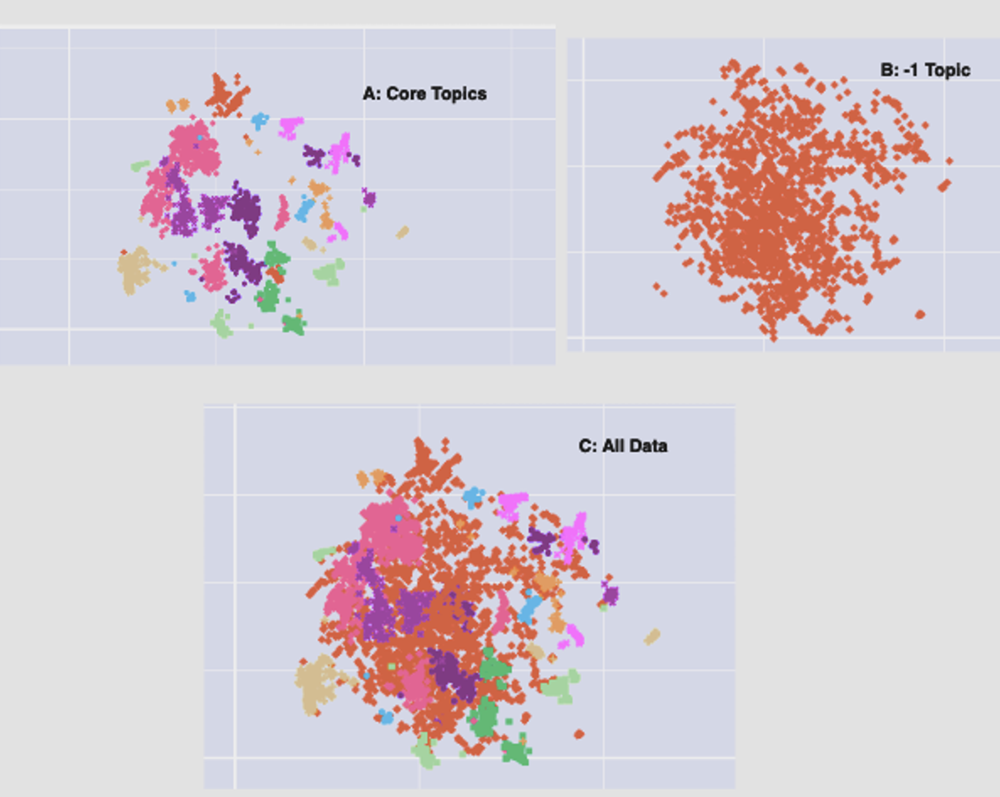

# Outlier Mitigation

In the BERTopic workflow, HDBSCAN assigns a **-1 label** to messages that do not fall within any dense cluster region. These are not necessarily noise — they often represent fringe discussions that sit at the periphery of core topics and take the same shape as the full data. In practice, 40–60% of messages in a typical dataset fall into the -1 cluster, making effective outlier handling a significant methodological concern.

This document covers:
- How the -1 cluster forms and what it represents
- Two mitigation approaches investigated: soft clustering and k-means
- Findings and trade-offs from applying each approach

> **Cross-references:**
> - Core pipeline and HDBSCAN parameters: [`docs/workflow/`](../workflow/)
> - Annotation methodology: [`docs/annotation/`](../annotation/)

---

## The -1 Cluster: What It Is

*Figure 1: 2D UMAP distribution showing (A) core topics, (B) -1 messages, and (C) all data combined. The -1 messages span the full shape of the data rather than forming an isolated region — they are distributed across the entire embedding space, interspersed with and surrounding the core clusters.*

This spatial property is important: the -1 cluster is not a separate or peripheral region. It takes the same shape as the full dataset, which means -1 messages are not simply noise confined to the edges — they are fringe discussions that sit between, around, and within the structure of the core topics.

---

## Background

### How HDBSCAN Works

HDBSCAN is a density-based clustering algorithm designed to identify clusters of varying shapes and sizes within a dataset. Unlike traditional clustering algorithms that assume clusters to be spherical, this assumption breaks down when data forms clusters in more complex or irregular shapes — it is like trying to fit everything into a circle, even when the real groups are more diverse. HDBSCAN leverages minimum spanning trees and density reachability to uncover clusters in a more flexible manner. A minimum spanning tree can be thought of as the best way to connect all the points with the shortest possible lines, forming a tree structure that reveals how points naturally connect. Density reachability is about understanding how densely packed certain areas of the data are and finding clusters based on that density, rather than insisting on specific geometric shapes.

The algorithm proceeds in four steps:

**1. Minimum Spanning Tree (MST)**
HDBSCAN constructs an MST over the dataset — a tree-like structure connecting all data points with the minimum possible total edge length (the sum of the lengths of all potential edges in a graph). This reveals the underlying connectivity between points without imposing a fixed shape.

**2. Single Linkage Clustering**
Clusters are formed by progressively joining points with the shortest distance between them. HDBSCAN employs varied distance metrics across different points for robustness, rather than applying a single global threshold.

**3. Condensed Dendrogram**
The resulting hierarchy is represented as a dendrogram, and a condensed version of this dendrogram is created by removing branches that do not significantly contribute to the clustering structure. This condensation aids in identifying stable clusters by stripping away transient or insignificant groupings.

**4. Stability**
HDBSCAN emphasises the stability of clusters by identifying areas in the condensed tree where branches persist. This ensures robustness against noise and identifies clusters that consistently appear across different perspectives on the data.

---

### The Membership Vector

The membership vector in HDBSCAN is a component that provides information about the association of each data point with the identified clusters. For each point, the membership vector is essentially a set of scores indicating the probability or strength of affiliation with each cluster. This vector reflects the density-based nature of HDBSCAN. It is worth noting that the membership scores represent the strength of association between a data point and different clusters — these scores are not probabilities in the traditional sense; they indicate how well a point fits into each cluster.

**1. Nature of the vector**
- The probability assignment in HDBSCAN is derived from the stability of a point's cluster membership across different levels of the cluster hierarchy.
- The probability assigned to a data point reflects the stability of its cluster membership. Points that are consistently part of the same cluster across different levels of the hierarchy are assigned higher probabilities.
- Stability is assessed by considering how often a point is grouped together with others in the same cluster as we move up and down the hierarchy. If a point consistently belongs to the same cluster, it is deemed more stable, and its probability of belonging to that cluster is higher.
- The stability of a cluster is also taken into account. If a cluster persists across different levels of the hierarchy, the points within that cluster are assigned higher probabilities.
- The output is a set of probabilities for each data point indicating its likelihood of belonging to different clusters. However, these probabilities do not necessarily sum to one for each data point.

**2. Probability distribution**
The membership vector, when normalised, can be interpreted as a probability distribution. Each element represents the likelihood of the corresponding point belonging to a specific cluster. The sum of probabilities across all clusters for a single point is equal to 1.

**3. Granular cluster assignments**
Unlike traditional clustering methods that assign each point to a single cluster, the membership vector allows for more granular assignments. A point may have significant membership scores across multiple clusters, capturing the ambiguity or overlap often present in real-world datasets.

**4. Soft clustering**
This concept of soft clustering, facilitated by the membership vector, accommodates scenarios where a point may exhibit characteristics of multiple clusters simultaneously — which is the basis of the soft clustering mitigation approach described below.

---

### How the -1 Cluster Forms

In HDBSCAN, the -1 cluster represents outliers or data points that do not fit well into any identified clusters. The formation of the -1 cluster is influenced by the density-based approach of HDBSCAN, which inherently distinguishes between core points, border points, and outliers. Five factors govern how points end up in -1:

1. **Density reachability threshold** — HDBSCAN uses a density reachability threshold to determine whether a point is part of a dense region. Points that do not meet this threshold are considered outliers and are assigned to the -1 cluster.
2. **Outliers in sparse regions** — points situated in sparse regions of the dataset, where the density is below the defined threshold, are more likely to be labelled as outliers. These regions may represent areas with lower data density, where traditional clustering algorithms might struggle to identify meaningful clusters.
3. **Connectivity to core points** — the connectivity of a point to core points within the minimum spanning tree plays a role. If a point does not have sufficient connections to core points, it is more likely to be designated as an outlier.
4. **Flexibility in cluster shapes** — the flexibility of HDBSCAN to identify clusters of various shapes means that outliers are not solely determined by geometric considerations. Instead, the algorithm adapts to local density variations, making it effective in capturing outliers in complex datasets.
5. **Influence of parameters** — the formation of the -1 cluster is also influenced by the parameters set during execution, such as the minimum cluster size and other density-related parameters. Adjusting these parameters can impact the identification of outliers: a larger minimum cluster size produces more -1 messages; a smaller one allows smaller clusters to form, reducing -1 but potentially fragmenting meaningful topics.

---

## Mitigation Approaches

The clustering approach in BERTopic classifies topics into two types: **core topics** (dense areas identified by HDBSCAN) and the **fringe topic (-1)**, encompassing messages that don't fall within or close to any dense areas. Each message is assigned a membership vector indicating a probability distribution over all topics. Two approaches are investigated to mitigate the presence of -1:

1. **Soft clustering** — utilises the membership vector to assign -1 messages to one or multiple topics, up to 5 topics, based on specific criteria (discussed in the next section).
2. **K-means:**
   - Unlike density-based approaches, k-means assigns each message to one of the specified buckets (identified by k).
   - HDBSCAN is initially applied to identify the number of dense areas. Given that the -1 topic often reflects the structure of the entire data (as shown in Figure 1), k-means is applied solely to the -1 cluster, using the same number of dense areas discovered by HDBSCAN as k.

**Sampling and analysis strategy (both approaches):**
- Sample from the topic breakdown in each output
- Annotate the resulting topics
- Analyse relationships between fringe topics and core topics to determine whether fringe topics are genuinely on the periphery between various cores and assess the utility of outliers in this setup
- For k-means: conduct a comparative analysis against the soft clustering output to reveal whether k-means provides a distinct perspective on the data

**Dataset:** A domain-specific economic dataset was used for this investigation. This dataset was selected because of familiarity with the domain, enabling domain expert analysis of the results.

---

## Soft Clustering

### Approach

The soft clustering approach leverages the membership vector to reassign -1 messages to one or more core topics. The `SoftReclusterer` is applied once BERTopic is trained and membership vectors are extracted. It is governed by four parameters:

| Parameter | Description |
|---|---|
| `min_membership_score` | Minimum membership score required for a point to be considered part of a cluster |
| `max_core_clusters` | Maximum number of core clusters a point can be assigned to (e.g. up to 5) |
| `min_fringe_cluster_size` | Minimum number of points required to validate a fringe cluster; below this threshold the group is treated as an outlier |
| `threshold_ratio` | Determines the membership score threshold relative to the maximum score in the vector |

**On `threshold_ratio`:** when `method='ratio'`, the threshold is `max_membership_score × threshold_ratio`. For example, if the maximum score in the vector is 0.6 and the ratio is 0.5, the threshold is 0.3 — any cluster with a score ≥ 0.3 qualifies as a fringe assignment for that point. This prevents assignments when scores are closely bunched, ensuring fringe assignments reflect genuine secondary membership rather than noise in the vector.

The result is a fringe breakdown: -1 messages are reassigned to one or more core topics based on these criteria, with residual messages that do not meet the thresholds remaining as true outliers.

---

### Observations

#### General

1. **Relevance within topics** — fringe topic discussions are generally centred around one or more core topics. No instances were observed where fringe topics contained messages entirely outside the scope of the identified core topics.
2. **Obscurity** — some messages within fringe topics are occasionally obscure or lack sufficient information. Despite this, domain experts can recognise and contextualise them without difficulty.
3. **Proximity to most probable topic** — messages close to the fringe tend to align with their most probable core topic rather than exhibiting balanced membership across several. The primary association dominates even when secondary scores exist.
4. **Persisting parameter challenges** — the chosen ratio and hyperparameters still produce a significant proportion of residual outliers. Further tuning is necessary to balance inclusion and quality.
5. **Increased control** — despite these challenges, working with membership vectors offers more control and interpretability than adjusting UMAP or HDBSCAN parameters directly. The effect of parameter changes is more predictable and auditable.

#### Fringe Topics

1. **Association with core topics** — fringe topics are predominantly associated with one core topic. It was rare to observe fringe topics without a clear primary core association, even when secondary associations existed.
2. **Homogeneity** — messages within a fringe topic typically share common themes and context, indicating the algorithm successfully groups relevant discussions. Fringe topics tend to explore specific nuances or sub-topics of a core rather than mixing unrelated content.
3. **Multiplicity of associations** — contrary to initial expectations, the majority of fringe topics align primarily with one core topic rather than spanning multiple. Multi-core associations are more apparent to domain experts through qualitative review than through the membership scores alone. Instances of genuine multi-core fringe topics were infrequent, suggesting that -1 is normally a fringe of one topic rather than multiple.
4. **Differentiation from outliers** — fringe topics are distinguishable from true outliers: fringe topics have a clear primary core association, while the residual outlier cluster lacks any coherent theme across its messages.

#### Outlier Cluster

The residual outlier cluster — messages that remain -1 after soft clustering — is a mixed bag rather than a thematically coherent group. These messages cover a wide range of subjects with uncommon or unusual combinations of keywords and contextual information that do not fit neatly into any core cluster. They may represent genuinely ambiguous discussions, highly specific sub-topics without sufficient mass to form their own cluster, or messages whose content is too sparse to classify reliably. The parameter choice directly determines how large this residual cluster is.

---

### Pros

**Methodological control**
Working with membership vectors is more interpretable than adjusting UMAP or HDBSCAN parameters. The effect of changing `min_membership_score` or `threshold_ratio` is directly observable in the fringe assignments, making iterative refinement more tractable.

**Analytical value of fringe topics**
Fringe topics often capture interdisciplinary discussions that span multiple core areas — content that is frequently valuable precisely because it crosses thematic boundaries. Soft clustering also improves recall: -1 is not always noise. Recovering fringe discussions that genuinely belong near a core increases the proportion of data available for analysis and can potentially improve thematic coverage.

---

### Cons

**Parameter tuning overhead**
The soft clusterer requires careful hyperparameter tuning. Poorly chosen parameters produce a large residual outlier cluster, and rapid evaluation of parameters is essential to avoid repeated annotation effort and minimise overhead.

**Increased annotation load**
Fringe topics increase the total number of topics an annotator must review. Each fringe cluster requires description and assessment, adding steps to the annotation process.

---

## K-Means Comparison

K-means was applied to the -1 cluster in isolation, with k set equal to the number of core topics identified by HDBSCAN. The rationale: since the -1 cluster takes the same shape as the full data (Figure 1), applying k-means with the same number of groups as HDBSCAN found provides a direct structural comparison of what each approach discovers within the outlier space.

### Findings

**Common topics**
Both approaches identified overlapping thematic groupings within the -1 cluster. Topics with broad, widely-discussed themes appeared in both outputs, suggesting robustness in identifying the major patterns present in the outlier space. Where both methods agreed, confidence in the thematic grouping is higher.

**Distinct topics**
Each approach surfaced topics that had no clear equivalent in the other. Some themes identified by soft clustering did not appear in the k-means output, and k-means identified distinct groupings — particularly around narrower sub-topics — that soft clustering left in its residual outlier cluster. This suggests the two approaches are sensitive to different structural properties of the -1 space.

**Similar but different**
Several topics appeared in both outputs but with different emphasis or granularity. K-means tended to produce broader groupings that merged what soft clustering split into distinct fringe topics. Conversely, soft clustering occasionally identified finer-grained associations that k-means subsumed into a larger cluster.

### Observations

- The granularity and specific focus of topics differs between the two approaches even when broad themes overlap.
- Some topics in one approach have broader or narrower counterparts in the other, rather than direct equivalents.
- The diversity of topics within each output reflects the distinct patterns each algorithm is sensitive to: density reachability for soft clustering, geometric distance for k-means.
- K-means results diverge from the soft clustering output in ways that are complementary rather than contradictory — each captures aspects the other misses.

### Conclusion

K-means applied to the -1 cluster contributes complementary insights rather than duplicating soft clustering findings. Commonalities indicate robustness in identifying broad thematic groupings within the outlier space. Unique k-means findings suggest it recovers patterns that remain in the soft clustering residual outlier cluster — the two approaches are more complementary than redundant.

K-means is simpler to apply and requires no membership vector tuning, but provides less interpretable and less nuanced assignments. Soft clustering provides richer analytical structure but demands more tuning effort. Using both in combination — soft clustering for nuanced recovery, k-means for structural validation — is a viable strategy where annotation resource allows.

---

## Summary: Trade-offs

| | Soft clustering | K-means |
|---|---|---|
| Basis | HDBSCAN membership vector scores | Geometric distance to centroid |
| Multi-topic assignment | Yes — up to `max_core_clusters` | No — hard assignment to one cluster |
| Interpretability | High — scores are auditable and parameter effects are observable | Lower — centroid-based assignments are less transparent |
| Parameter sensitivity | High — requires tuning of 4 parameters | Moderate — k is fixed to HDBSCAN topic count |
| Residual outliers | Yes — messages below thresholds remain as outliers | None — all messages are assigned |
| Annotation overhead | Higher — fringe topics add to workload | Moderate |
| Best for | Recovering analytically useful fringe discussions with nuance | Quick secondary view of -1 structure; complementary validation |

---

## Checklist

- [ ] -1 proportion estimated after initial BERTopic run
- [ ] Decision made: soft clustering, k-means, or both
- [ ] **Soft clustering:** `SoftReclusterer` parameters set (`min_membership_score`, `max_core_clusters`, `min_fringe_cluster_size`, `threshold_ratio`)
- [ ] **Soft clustering:** fringe topics sampled and annotated
- [ ] **Soft clustering:** fringe topic associations with core topics reviewed
- [ ] **Soft clustering:** residual outlier cluster reviewed for any recoverable content
- [ ] **K-means:** k set equal to HDBSCAN topic count; applied to -1 cluster only
- [ ] **K-means:** topics sampled and annotated
- [ ] **K-means:** output compared with soft clustering to identify common, distinct, and overlapping themes
- [ ] Final decision: which fringe/k-means topics to include in the analysis
