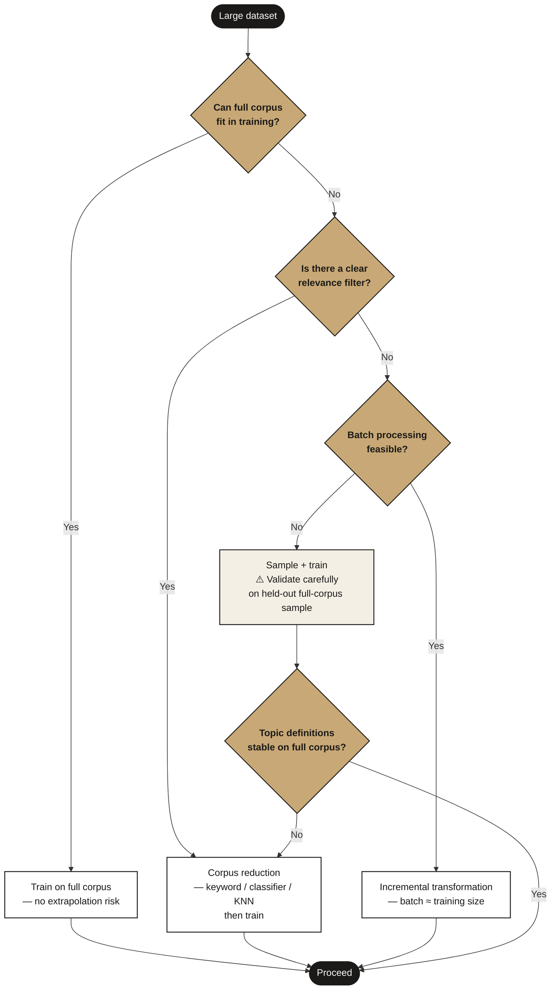

# Sampling & Extrapolation

How to handle datasets too large to model in full — and the critical problem that arises when a topic model trained on a sample is applied to the full corpus.

> **Cross-references:**
> - Core pipeline context: [`docs/workflow/`](../workflow/)
> - Outlier mitigation: [`docs/outliers/`](../outliers/)

---

## The Problem

When working with large datasets, it is common practice to train the topic model on a sample and then apply the trained model to the full corpus. This works well in many contexts, but with UMAP + HDBSCAN it introduces a silent failure mode: **topic definitions shift significantly when the model is applied to data outside its training distribution**.

The failure is silent because initial evaluation on the training sample shows high performance. The degradation only becomes apparent when the model is applied to the full dataset — at which point analyst-defined topic descriptions may no longer match what the model is actually assigning to those topics. A topic initially defined as covering one specific narrative can expand to absorb a substantially different set of messages in the broader corpus.

**On the training sample** — topics are compact and well-separated in the UMAP space:

**On the full corpus** — the same topics have expanded dramatically and their boundaries have collapsed into each other:

The shift between these two states is the extrapolation problem.

In practice this has been observed as a significant issue on large datasets and a lesser but still present issue on moderately large ones. It is one of the most common silent failures in applied topic modelling.

---

## Why It Happens

### UMAP's extrapolation limitation

UMAP learns a reduced embedding space from the training data, preserving the density structure of that specific sample. When new data points are projected into this learned space, UMAP must place them based on a latent structure it never saw — it was not designed for extrapolation.

Two UMAP parameters make this especially sensitive:

**`n_components`** — the dimensionality of the reduced space. A value chosen to capture the structure of a 100K training sample may dramatically underfit a 1M document corpus. The latent space is too simple to represent the broader data, causing messages with different content to collapse into the same region.

**`n_neighbors`** — controls the balance between local and global structure. Lower values preserve fine-grained local relationships in the training data but generalise poorly to unseen data that introduces new local structures. Higher values emphasise global structure and may generalise better to diverse larger datasets, but can obscure important local distinctions.

### HDBSCAN's fixed-cluster prediction

HDBSCAN is not designed for online prediction. When applied to new data points, it fixes the condensed tree learned during training and determines where each new point falls within that existing structure. This means:

1. Clusters are defined entirely by the training sample's density structure
2. New data points that fall in regions of the space that were sparse during training get assigned to whatever cluster boundary they happen to be nearest — regardless of whether that assignment is semantically meaningful
3. If the full corpus has substantially different density patterns from the training sample (which it typically does, being much larger), the cluster assignments for new points can be systematically wrong

The combined effect: UMAP places new points in an oversimplified latent space, and HDBSCAN assigns them to clusters that were calibrated for a different data distribution.

---

## Solutions

### Solution 1 — Corpus Reduction (recommended)

The core principle: reduce the full dataset to a relevant, manageable size before training, so the model is trained and applied to data drawn from the same distribution. The extrapolation problem disappears when training and application data are comparable in size and structure.

The method used to reduce the corpus depends on what resources are available. All of the following serve the same goal:

**Keyword-based:**
The simplest approach — no labelled data required. Sample a small subset, identify relevant discussions manually, extract representative keywords, then retrieve all matching documents from the full corpus. Can also be combined with a preliminary topic model to automate keyword discovery: train a rough model on a sample, identify relevant topics, extract their keywords, discard the model, and use the keywords to filter. Fast to implement; precision depends on keyword quality.

**Classifier trained on labelled instances:**
Train a binary classifier on labelled examples of relevant and irrelevant content, then apply it to the full corpus. More precise than keyword filtering; requires annotation effort upfront. Any standard text classifier works here — the goal is relevance filtering, not thematic analysis.

**KNN-based (semantic similarity):**
Use annotated exemplar embeddings to classify documents via nearest-neighbour search — relevant documents are those whose embeddings are closest to the annotated relevant examples. No retraining needed as new examples are added; scales well to large corpora. See [`semantic-knn`](https://github.com/ay94/semantic-knn) for an implementation.

**Zero-shot classification:**
Apply a pre-trained classifier with target category labels to filter without any project-specific labelled data. Lower precision than trained approaches but requires no annotation.

These can be combined — keyword filtering as a coarse first pass, then a classifier or KNN for precision. The right choice depends on what labelled data, embedding infrastructure, and time are available.

---

### Solution 2 — Incremental Transformation

> **Status:** Proposed — requires further testing before production use.

Rather than applying the trained model to the full corpus in one pass, divide the unseen data into batches approximately the same size as the training data and transform each batch separately.

For example: a model trained on 100K documents applied to 1M documents would process 10 batches of 100K. Each batch is transformed independently, keeping the input size consistent with what the model was trained on.

**Sampling within batches:** The training sample must itself be representative. If the full corpus is divided into chunks, sample from each chunk proportionally until reaching the training cap — rather than sampling all training data from one region of the corpus.

**Tradeoff:** Incremental transformation adds computational and maintenance overhead. It does not fully eliminate the extrapolation problem — it reduces it by keeping batch sizes closer to training size — but it does not guarantee that each batch has the same density structure as the training data.

---

## Decision Guide

---

## Checklist

- [ ] Dataset size assessed relative to computational budget before choosing a training strategy
- [ ] If training on a sample: extrapolation risk acknowledged and a mitigation strategy chosen
- [ ] If using keyword filtering: keywords validated as representative before filtering the full corpus
- [ ] If using incremental transformation: batch size matched to training corpus size
- [ ] Topic definitions validated on a held-out sample of the full corpus before final annotation

---

## References

- [UMAP transform documentation](https://umap-learn.readthedocs.io/en/latest/transform.html)
- [HDBSCAN prediction tutorial](https://hdbscan.readthedocs.io/en/latest/prediction_tutorial.html)
