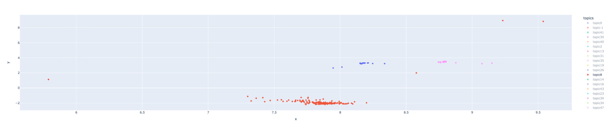
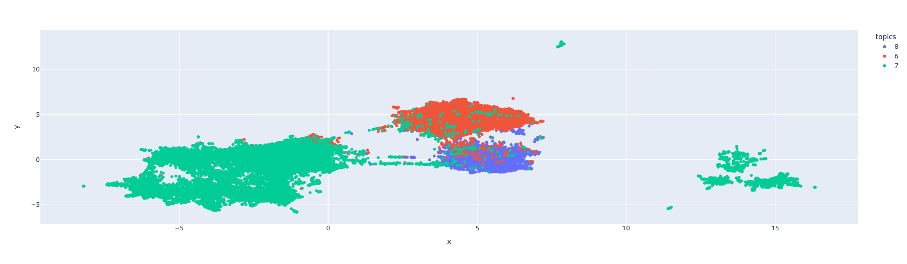
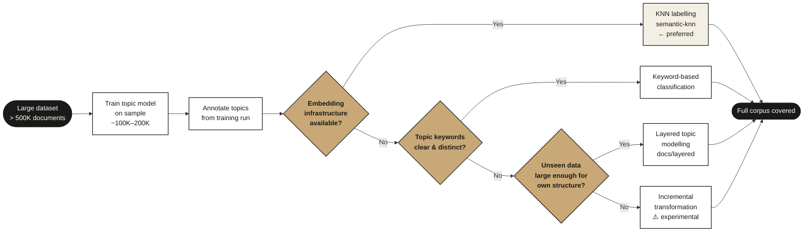

# Sampling & Extrapolation

How to handle datasets too large to model in full — and the critical problem that arises when a topic model trained on a sample is applied to the full corpus.

> **Cross-references:**
> - Core pipeline context: [`docs/workflow/`](../workflow/)
> - Outlier mitigation: [`docs/outliers/`](../outliers/)

---

## The Problem

Topic modelling with UMAP + HDBSCAN has a hard computational ceiling: in practice, the pipeline becomes unstable above approximately 500K documents due to memory and processing constraints. For datasets above this threshold, training must happen on a sample — typically 100K–200K documents — with the trained model then applied to the remaining data.

This is where the extrapolation problem emerges. Sampling is not optional for large corpora; it is required. But UMAP and HDBSCAN were not designed to extrapolate to data outside their training distribution, so applying the trained model to the full corpus introduces a **silent failure mode: topic definitions shift significantly on the unseen data**.

The failure is silent because initial evaluation on the training sample shows high performance. The degradation only becomes apparent when the model is applied to the full dataset — at which point analyst-defined topic descriptions may no longer match what the model is actually assigning to those topics. A topic initially defined as covering one specific narrative can expand to absorb a substantially different set of messages in the broader corpus.

**On the training sample** — topics are compact and well-separated in the UMAP space:

**On the full corpus** — the same topics have expanded dramatically and their boundaries have collapsed into each other:

The shift between these two states is the extrapolation problem.

In practice this has been observed as a significant issue on large datasets and a lesser but still present issue on moderately large ones. It is one of the most common silent failures in applied topic modelling.

---

## Why It Happens

### UMAP's extrapolation limitation

UMAP learns a reduced embedding space from the training data, preserving the density structure of that specific sample. When new data points are projected into this learned space via [transform mode](https://umap-learn.readthedocs.io/en/latest/transform.html), UMAP must place them based on a latent structure it never saw — it was not designed for extrapolation.

Two UMAP parameters make this especially sensitive:

**`n_components`** — the dimensionality of the reduced space. A value chosen to capture the structure of a 100K training sample may dramatically underfit a 1M document corpus. The latent space is too simple to represent the broader data, causing messages with different content to collapse into the same region.

**`n_neighbors`** — controls the balance between local and global structure. Lower values preserve fine-grained local relationships in the training data but generalise poorly to unseen data that introduces new local structures. Higher values emphasise global structure and may generalise better to diverse larger datasets, but can obscure important local distinctions. See this [interactive tutorial](https://pair-code.github.io/understanding-umap/) for a visual breakdown of how this parameter shapes the embedding.

### HDBSCAN's fixed-cluster prediction

HDBSCAN constructs a [condensed tree](https://hdbscan.readthedocs.io/en/latest/prediction_tutorial.html) representation of the clustering hierarchy, which is used to extract clusters at different density levels. However, it encounters challenges when dealing with new data points, as they have the potential to alter the underlying clustering. To mitigate this, it fixes the existing clustering and determines where each new point falls within the condensed tree — assuming the tree remains unchanged.

This design means HDBSCAN is not suited for online prediction. In practice:

1. Clusters are defined entirely by the training sample's density structure
2. New data points that fall in regions of the space that were sparse during training get assigned to whatever cluster boundary they happen to be nearest — regardless of whether that assignment is semantically meaningful
3. If the full corpus has substantially different density patterns from the training sample (which it typically does, being much larger), the cluster assignments for new points can be systematically wrong

The combined effect: UMAP places new points in an oversimplified latent space, and HDBSCAN assigns them to clusters that were calibrated for a different data distribution.

---

## Extending Coverage to the Full Corpus

The training sample produces a topic model with well-defined clusters. The challenge is extending that model's coverage to the remaining data — the documents it never saw — without the drift that comes from applying UMAP + HDBSCAN directly to out-of-distribution data.

Three approaches, in order of preference:

---

### Approach 1 — KNN Labelling (preferred)

The trained topic model has already defined a set of clusters, each with its own embedding structure. Rather than projecting new documents through UMAP and HDBSCAN, use the cluster exemplars from the training run to label the remaining documents via semantic nearest-neighbour search.

Each unseen document is compared against the annotated exemplars from each cluster. It is assigned to whichever cluster it is most similar to, based on embedding distance. No new model is needed; no UMAP projection of unseen data; no HDBSCAN extrapolation. The labelling is driven entirely by the semantic structure established during training.

This is the approach the pipeline was designed around. See [`semantic-knn`](https://github.com/ay94/semantic-knn) for an implementation built for this use case.

**When to use:** The topic model has been trained and annotated. Cluster definitions are stable. The goal is coverage of the remaining corpus using what the model already learned.

#### Choosing K and the similarity threshold

Two parameters govern the quality of the retrieved sample:

- **K** — the number of neighbours to retrieve. K affects precision: a small K returns only the most similar items, while a large K casts a wider net and may pull in less relevant content.
- **Similarity threshold** — the distance cut-off beyond which neighbours are excluded. The threshold determines relevance: items within the threshold are considered relevant, items beyond it are not.

#### Setting the similarity threshold using centroid distance

A principled approach is to base the threshold on the distance distribution of points already known to belong to the cluster:

1. For each cluster, compute the distance of every point from the cluster centroid.
2. Inspect the distribution of these distances.
3. Use the mean or a percentile (e.g. mean + one standard deviation) as the similarity threshold.

This grounds the threshold in the actual spread of the cluster rather than an arbitrary value.

**Important caveat:** this approach assumes the geometric centroid is a good proxy for the semantic centre of the cluster. This holds before the cluster has been characterised by an analyst. Once analysts have annotated and interpreted the cluster, the semantic centre — the point best representing what the cluster *means* — may differ from the geometric centre. After characterisation, the threshold should be based on the distance distribution from the already-annotated points, not the raw geometric centroid.

#### Sampling order

Sample before deduplication, not after. Deduplication removes repeated messages — if applied before sampling, the sample will not reflect the actual distribution of content in the data. Repeated messages (e.g. coordinated posting, viral content) are analytically significant; their frequency in the sample should mirror their frequency in the data. Apply deduplication after the sample has been drawn, if at all.

---

### Approach 2 — Keyword-Based Classification

Extract representative keywords from each trained topic. Use those keywords to classify unseen documents — a document is assigned to the topic whose keywords it most closely matches. This can be as simple as keyword overlap scoring or as sophisticated as a trained classifier built from the keyword-defined classes.

The topic model output informs the classification, but the classification itself does not require re-running UMAP or HDBSCAN on the new data.

**When to use:** Embedding infrastructure is not available for KNN, or a faster, more interpretable labelling method is preferred. Less precise than KNN for semantically similar topics with overlapping vocabulary.

---

### Approach 3 — Layered Topic Modelling

Rather than labelling the unseen data using the first model, run a second topic model on it — informed by but independent of the first. The second model discovers whatever structure exists in the unseen portion, and the two models are integrated via a shared annotation schema.

This is not a disposable model — it is a second analytical layer. It is best used when the unseen data is large enough that its own internal structure is worth discovering rather than just assigning to the first model's categories.

See [`docs/layered/`](../layered/) for the full multilayered topic modelling approach.

**When to use:** The unseen portion of the corpus is large and potentially contains narratives not well-represented in the training sample. Coverage via labelling would force content into ill-fitting categories.

---

### Approach 4 — Incremental Transformation

> **Status:** Proposed — requires further testing before production use.

Divide the unseen data into batches approximately the same size as the training data and transform each batch separately through the trained UMAP + HDBSCAN model. This reduces the extrapolation gap by keeping each input batch closer to the training distribution in size.

**Tradeoff:** Reduces but does not eliminate the extrapolation problem. Adds computational overhead. The training sample must itself be representative — sample proportionally across data sources rather than from one region of the corpus.

---

## Decision Guide

---

## Checklist

- [ ] Dataset size assessed — if above ~500K, a sampling and coverage extension strategy is required
- [ ] Training sample is representative — sampled proportionally across data sources, not from one region
- [ ] Coverage extension approach agreed before annotation begins (KNN / keyword / layered / incremental)
- [ ] If using KNN: cluster exemplars saved from the training run before applying to unseen data
- [ ] If using keyword classification: keywords validated as distinct and representative per topic
- [ ] If using layered modelling: annotation schema agreed to bridge both models
- [ ] Topic definitions spot-checked on a sample of the covered data before final annotation

---

## References

- [UMAP transform documentation](https://umap-learn.readthedocs.io/en/latest/transform.html)
- [HDBSCAN prediction tutorial](https://hdbscan.readthedocs.io/en/latest/prediction_tutorial.html)
- [Understanding UMAP — interactive tutorial](https://pair-code.github.io/understanding-umap/)
