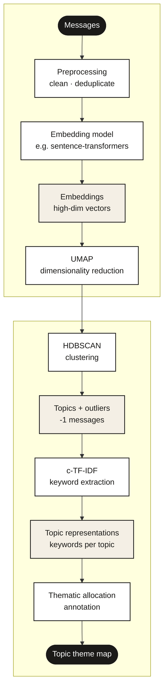

# Topic Allocation Workflow

Topic allocation is a methodology for segmenting a collection of messages into semantically similar clusters — "topics" — and organising those topics into a structured thematic breakdown. It is a bottom-up process: the pipeline first divides the data into clusters, which are then characterised through annotation and organised into sub-themes and overarching themes.

The result is a **topic theme map** — a hierarchical structure that assigns every message in the dataset to a specific theme via its topic. How this map is used depends on the project:

- **Exploratory projects** — the map guides qualitative analysis and surfaces patterns in the data
- **Filtering projects** — the map identifies topics of interest for deeper investigation
- **Classification projects** — the map assigns messages to predefined categories, with an evaluation stage to assess accuracy

The pipeline has five stages: preprocessing, semantic representation, topic modelling, thematic allocation, and evaluation.

In practice, the modelling stage (UMAP → HDBSCAN → c-TF-IDF) is most commonly implemented via **BERTopic**, a Python library that wraps all three steps into a single interface. Each step can also be run independently using dedicated libraries (`umap-learn`, `hdbscan`, or equivalent), or via alternative frameworks. This document describes the methodology in terms of BERTopic where relevant and will be updated as new tools are adopted.

> **Cross-references:**
> - Annotation methodology: [`docs/annotation/`](../annotation/)
> - Evaluation methodology: [`docs/evaluation/`](../evaluation/)
> - Outlier handling: [`docs/outliers/`](../outliers/)

---

## Pipeline Overview

---

## Stage 1: Preprocessing

**Objective:** Clean and standardise the raw data before any modelling takes place.

Preprocessing quality directly affects the quality of topic representations. Elements like links, hashtags, and emojis — if retained — can appear in keyword lists and reduce their interpretability. Duplicate messages can cause the clustering algorithm to form topics around repetition rather than thematic content.

**Standard cleaning steps:**

- Remove URLs and links
- Remove mention signs (@)
- Remove hashtag signs (#) — retain the text, remove the symbol
- Remove emojis
- Fix encoding issues
- Remove stopwords
- Deduplicate messages

**Note on deduplication:** when coordination is an analytical objective, deduplicating before drawing an analytical sample removes the coordination signal from the sample. Repeated messages reflect coordinated behaviour, and their frequency in the sample should mirror their frequency in the data. If deduplication happens before sampling, that distribution is eliminated and any coordination analysis on the sample will be working with tampered or incomplete data. In such cases, deduplication should be applied after the analytical sample is drawn — not before.

---

## Stage 2: Semantic Representation

**Objective:** Convert each message into a numerical vector that captures its semantic meaning.

Each preprocessed message is converted into a **contextualised vector** — an embedding — that captures the semantic essence of the text rather than its lexical characteristics. Two messages can use different words and mean the same thing, or use the same word and mean different things; embeddings reflect these contextual nuances rather than surface form. Messages that are semantically similar will have embeddings that are close together in this high-dimensional space.

This transformation is achieved using **transformer models**, via a library such as `sentence-transformers`. These models are trained specifically on sentence similarity tasks and take preprocessed messages as input to produce embeddings that reflect each message's meaning in context. The resulting embeddings are the foundation for the next stage: clustering messages into topics based on contextual similarity rather than keyword overlap.

**Practical consideration:** transformer models have a maximum sequence length (`max_seq_length`) that determines how many tokens are processed per message. Content beyond this limit is truncated. Model selection should account for typical message length in the dataset and the trade-off between model size, speed, and linguistic range (multilingual vs monolingual, general vs domain-specific).

---

## Stage 3: Topic Modelling

**Objective:** Segment the embedding space into clusters, each representing a topic, and produce a keyword representation for each.

This stage has three components — dimensionality reduction, clustering, and keyword extraction — that can be run via a dedicated topic modelling library (such as **BERTopic** or **TrueTopic**) or assembled from individual components (e.g. `umap-learn`, `hdbscan` from scikit-learn or standalone).

BERTopic takes as input the collection of messages and their corresponding embeddings. These embeddings are high-dimensional representations — each dimension contributes to the overall position in the semantic space, but individual dimensions are not interpretable in isolation. This high dimensionality makes direct clustering impractical, which is why dimensionality reduction is applied first.

### Dimensionality Reduction — UMAP

The high-dimensional embeddings are compressed into a lower-dimensional space using UMAP. UMAP preserves the neighbourhood structure of the original space — messages that were semantically close remain close after reduction — while making the data tractable for clustering.

### Clustering — HDBSCAN

HDBSCAN identifies dense regions in the reduced space and groups messages within them into clusters. Each cluster is a topic candidate. Messages that do not belong to any dense region are assigned a **-1** label — these are outliers. Unlike k-means, HDBSCAN does not require the number of topics to be specified in advance; it determines this from the data's own density structure.

### Keyword Extraction — c-TF-IDF

Once topics are formed, each is represented by keywords extracted using **c-TF-IDF** (class-based Term Frequency-Inverse Document Frequency). Keywords are selected based on how frequently they appear within a given topic relative to how rarely they appear across the rest of the corpus — surfacing terms that are distinctive to that topic rather than common across all of them.

These keyword representations are used to interpret each topic during annotation and to visualise relationships between topics.

---

## Stage 4: Thematic Allocation

**Objective:** Describe each topic, organise topics into sub-themes and themes, and produce a topic theme map.

After topic modelling, each topic is a cluster of messages with a keyword representation. An analyst reviews a sample of messages from each topic to characterise its content. This process:

1. **Describes each topic** — identifies the dominant narrative or discussion pattern
2. **Classifies each topic** — assesses relevance to the project's objectives and assigns it to a pattern of discussion
3. **Organises topics** — groups descriptions into sub-themes and overarching themes to form the thematic breakdown

The result is a **topic theme map**: every topic — and by extension, every message — is assigned to a specific theme and sub-theme.

The annotation methodology (how messages are sampled, how descriptions are produced, how homogeneity is assessed) is covered in [`docs/annotation/`](../annotation/).

---

## Stage 5: Evaluation

**Objective:** Assess how accurately the thematic assignments generalise to all messages within each topic.

The evaluation stage tests whether the topic theme map holds across the full message set — not just the annotated sample. It is essential for classification projects and strongly recommended for any project where the map will be used to draw analytical conclusions.

### Procedure

1. **Sample creation** — draw a representative sample from the full dataset, stratified by the thematic breakdown
2. **Thematic alignment check** — review each message and assess whether it aligns with the definition of its assigned theme; topics may be reassigned at this stage
3. **Performance assessment** — calculate a performance metric for the annotation round
4. **Review and iteration** — the analyst and annotator review results and decide whether a further round of annotation and re-evaluation is needed
5. **Conclusion** — the process ends when thematic assignments are deemed satisfactory

Full evaluation methodology: [`docs/evaluation/`](../evaluation/).

---

## Outcomes

| Project type | Primary use of the map |
|---|---|
| **Exploratory** (qualitative analysis, disinfo) | Navigational tool — surfaces patterns, trends, and narratives for in-depth qualitative examination |
| **Filtering** (large datasets, initial scoping) | Filter — identifies and isolates topics of interest; makes large datasets manageable |
| **Classification** | Classification scheme — assigns messages to predefined themes; evaluation is essential |

---

## Challenges

### Outliers and the -1 cluster

HDBSCAN assigns messages that do not fit any dense cluster a `-1` label. The proportion of outliers is sensitive to `min_cluster_size`: increasing topic granularity typically increases the `-1` count. Managing this trade-off is covered in [`docs/outliers/`](../outliers/).

### Language barriers for annotators

Annotators working with data in languages they cannot read face accuracy challenges. Machine translation applied before annotation allows annotators to work with translated text. Methodological considerations are in [`docs/translation/`](../translation/).

### Annotation accuracy and sampling

Ensuring annotation accuracy and choosing an effective sampling strategy is a core methodological challenge. The granular annotation scheme in [`docs/annotation/`](../annotation/) addresses this directly.

### Evaluation complexity

Evaluating a topic theme map requires testing whether annotation generalises to all messages, not just the sample. See [`docs/evaluation/`](../evaluation/).

---

## Key Parameters

| Component | Key parameters | Effect |
|---|---|---|
| Embedding model | Model choice, `max_seq_length` | Determines how semantic meaning is captured; affects what topics are discoverable |
| UMAP | `n_components`, `n_neighbors`, `min_dist` | Controls how the embedding space is compressed; affects cluster separability |
| HDBSCAN | `min_cluster_size`, `min_samples`, `cluster_selection_method` | Controls topic granularity and the proportion of -1 outliers |

---

## Cross-references

| Topic | Where to look |
|---|---|
| Data collection before the pipeline runs | [`docs/data-collection/`](../data-collection/) |
| Large datasets and the UMAP extrapolation problem | [`docs/sampling/`](../sampling/) |
| The `-1` outlier cluster | [`docs/outliers/`](../outliers/) |
| Annotation and topic theme map construction | [`docs/annotation/`](../annotation/) |
| Heterogeneous topics and iterative refinement | [`docs/layered/`](../layered/) |
| Steering the embedding space toward analytical distinctions | [`docs/guided/`](../guided/) |
| Evaluating thematic allocation | [`docs/evaluation/`](../evaluation/) |
| Language and translation considerations | [`docs/translation/`](../translation/) |
