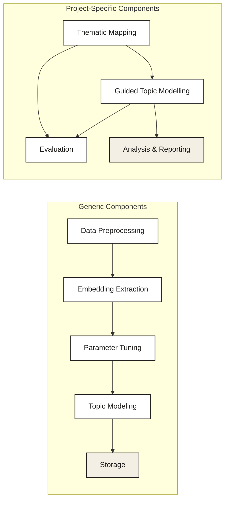
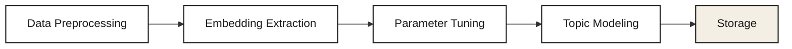
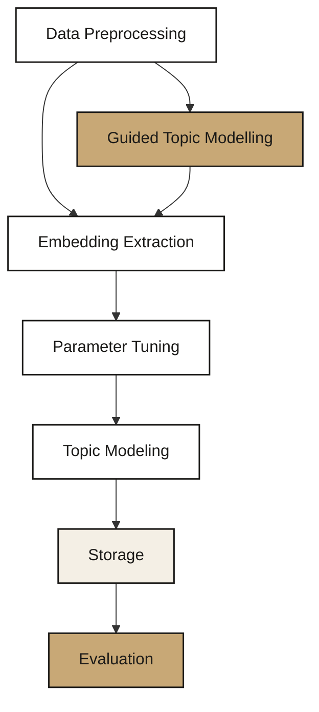
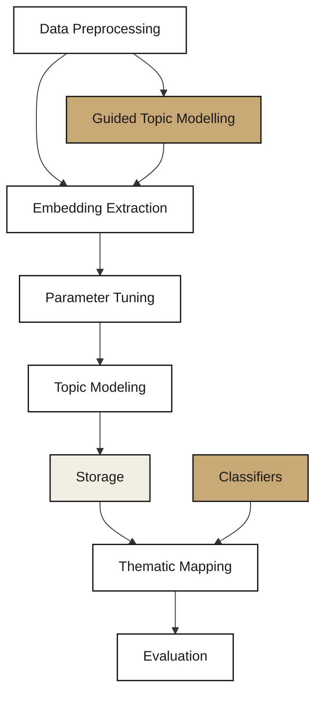

# Topic Modelling Workflows

This document describes the analytical workflows that can be proposed through topic modelling across various projects. It distinguishes between general exploration and more rigorous qualitative and quantitative analyses, detailing the methodologies, component variations, and architectural patterns involved. The aim is to provide a structured approach that can adapt based on project requirements.

> **Cross-references:**
> [`docs/workflow/`](../workflow/) · [`docs/annotation/`](../annotation/) · [`docs/evaluation/`](../evaluation/) · [`docs/guided/`](../guided/) · [`docs/layered/`](../layered/)

---

## Topic Modelling Architecture

Before discussing the various workflows, it is essential to understand the architecture of topic modelling. It can be dissected into several core components — some universal across all projects, others tailored to specific requirements. For a detailed walkthrough of the pipeline itself, see [`docs/workflow/`](../workflow/).

### Generic Components

These components are present in every topic modelling project, though their internal implementation may vary:

1. **Data preprocessing** — this initial stage involves cleaning and preparing the data for analysis. The extent and methods of preprocessing may vary depending on the data and project needs, however it will always be present.
2. **Embedding extraction** — this component transforms textual data into a semantic representation using sentence transformers.
3. **Parameter tuning** — this critical phase adjusts the model's parameters to optimise performance, typically involving UMAP and HDBSCAN.
4. **Topic model creation** — the prepared and embedded data is fed into the topic modelling algorithm to identify the underlying topics.
5. **Storage** — the final model and its outputs are stored for further analysis. The materials being stored may differ between projects, but there will always be things to store.

### Project-Specific Components

These components are selectively applied depending on the project's requirements and goals:

1. **Thematic mapping** — categorising the discovered topics into a broader thematic breakdown, a step that requires domain expertise and is often guided by the project's analytical objectives.
2. **Evaluation** — the process of assessing the model's effectiveness and accuracy. See [`docs/evaluation/`](../evaluation/).
3. **Embedding model fine-tuning (guided topic modelling)** — for projects with specific analytical goals — such as uncovering particular narratives or themes — embedding models like sentence transformers can be fine-tuned using targeted techniques such as contrastive learning. This fine-tuning process adjusts the model to focus more precisely on the project's areas of interest, enhancing its ability to identify and differentiate between topics. See [`docs/guided/`](../guided/).
4. **Analysis and reporting** — the final stage where results are analysed to derive insights and findings are reported. The depth and style of analysis and reporting are significantly influenced by the project's goals, ranging from exploratory summaries to detailed thematic explorations.

It is important to recognise that while the generic components form the backbone of any topic modelling project, the intricacies of their implementation may differ based on the unique demands of each project. Conversely, the project-specific components are selectively applied, dependent on the project's specific requirements and goals. Figure 1 presents a graphical representation of the architecture, with arrows indicating the order of execution.

---

## Adapting Topic Modelling Components and Architectures to Project Goals

Two core component types have been identified: generic components, which are integral to any topic modelling exercise, and project-specific components, which are tailored to meet the objectives of a particular project. Within this framework, both types of components may undergo modifications in their internal processes, influenced by the project's analytical goals and the data characteristics. This section briefly discusses these modifications and the diverse applications of topic modelling across various project proposals.

### Project Proposal Variations

**General exploration workflow** — this approach offers clients a means to independently explore their data. The data, segmented by the topic model, is provided without further analysis — often serving as a pilot or a minimally budgeted initiative. Variations of this workflow may aim more specifically at enhancing client capabilities, such as improving search functionality through keyword identification or generating training examples for classifiers. Although less common and typically embedded within larger projects, these proposals leverage topic modelling for its clustering and data segmentation capabilities, often utilising BERTopic due to its effectiveness over the individual use of UMAP and HDBSCAN.

**Qualitative and quantitative projects** — these projects focus on analysing specific datasets or events accurately over certain periods, aiming to provide precise quantifications that aid and direct qualitative analysis. Projects may be guided by predetermined themes or hypotheses, driving a more exploratory yet rigorous approach. The application of topic modelling in these contexts varies, serving either as a direct classifier or assisting in dividing the data into a thematic breakdown which can then be refined via classifiers.

### Component Flexibility

This differentiation in project types requires flexibility within the topic modelling components. Whether generic or project-specific, components need to be adaptable, designed to align with the unique demands of each project's scope, data nature, and analytical objectives. The following sections outline the various changes that each component can go through.

---

## Generic Components and Their Internal Modifications

**Data preprocessing**
- *Standard processes:* typically includes removing links, emojis, etc. Specific adjustments may be necessary for datasets in multiple languages, where unique preprocessing is applied based on language differences.
- *Metadata integration:* incorporating metadata like country or platform annotations is crucial. A flexible schema that can accommodate any data type, ensuring a consistent output format, is essential. This schema might be project-specific or universally applicable, with adjustable fields.

**Embedding extraction**

Changes in this component relate to data source and language:
- *Multilingual data:* requires a decision between a model that can handle each language specifically, a generic multilingual model, or translating the data into a unified language and finding a model to represent it in that language.
- *Data source:* data from social media platforms tends to have more restricted character length. Articles are generally long-context data and require a different model capable of handling that. These models may also require specific preprocessing — for example, `nomic-ai/nomic-embed-text-v1` requires adding a suffix to each sentence before processing.

**Parameter tuning**

While the tuning of most parameters remains consistent, the choice of clustering algorithm may vary depending on the project's specific needs. See [`docs/considerations/`](../considerations/) for details.

**Topic model creation**

The process generally remains the same; however, thematic allocation may necessitate generating sample data. In projects focused solely on topic segmentation without thematic analysis, this step may not apply. Regardless of the project type, annotating data with topic information is a standard requirement.

**Storage**

The nature of the project dictates storage needs. Essential elements — embeddings, the topic model, and annotated data — are stored universally. Sample storage is project-dependent, primarily required when thematic allocation is involved.

---

## Project-Specific Components and Their Internal Modifications

**Thematic mapping**
- *Basic sampling:* for some projects, a straightforward strategy such as selecting a small number of messages per topic (e.g. 10) for preliminary analysis might be employed. This approach generally necessitates several rounds of refinement and can require significant time to achieve a satisfactory thematic structure.
- *In-depth analysis:* more detailed projects may require examining a larger portion of each topic's content (e.g. 10%) to gain a deeper understanding. This method demands considerable time and analytical effort, however it is more flexible — making use of specific metrics such as entropy and silhouette scores to determine when the analysis has reached a point of diminishing returns. See [`docs/annotation/`](../annotation/).

**Evaluation**

The evaluation shifts from assessing basic relevance of topics in simpler projects to conducting detailed evaluations of thematic and sub-thematic layers in more complex analyses. This means that although the criteria for evaluation stay the same, the aspects of the data being evaluated vary. Despite the varying levels of thematic detail, the underlying evaluation criteria remain constant. See [`docs/evaluation/`](../evaluation/).

**Guided topic modelling**

This step is only applicable when the project is provided with a predefined set of interesting narratives to identify. The main variation in this component is whether a SetFit workflow is used to do contrastive learning or a different guided approach is taken. See [`docs/guided/`](../guided/).

**Analysis and reporting**

This essential phase is a constant across all types of workflows, varying significantly in scope and depth depending on the project. It is worth noting that analysis and reporting may not affect the design of the architecture, as it is often handled separately.

- *Methodology focus:* in some projects, analysis and reporting might solely focus on the methodology, with topic modelling serving as one phase among many rather than the ultimate objective. This approach typically outlines the procedural aspects of topic modelling within the larger project context.
- *Thematic analysis:* other workflows demand a more in-depth approach, incorporating both methodology and thematic analysis. This involves a blend of qualitative and quantitative analysis, offering a richer and more detailed examination of the topics and themes identified.

---

## Architecture Flexibility

The adaptability of topic modelling architecture is crucial in meeting the diverse needs of various projects. This section delves into how the presence and internal dynamics of components — whether generic or project-specific — alter to align with the project type and its objectives.

### General Exploration Workflows

#### Data Segmentation

This approach primarily leverages generic components to provide clients with data segmented by topic modelling, without further analysis on our part. Typically, this workflow integrates into broader projects rather than existing as an independent project.

#### Active Learning

Topic modelling here serves a dual purpose: dissecting data for better understanding and identifying training examples to enhance filtering algorithms. This could involve pinpointing relevant keywords within topics or extracting sentences valuable for training machine learning classifiers. The architecture incorporates active learning strategies, potentially integrating guided topic modelling and evaluation. The gold node indicates an optional component.

---

### Qualitative vs Quantitative Workflows

These workflows strike a balance between qualitative insights and quantitative analysis. The emphasis on qualitative aspects might necessitate the inclusion of thematic mapping, with sampling strategies reflecting the depth of qualitative analysis desired. Conversely, projects leaning towards quantitative analysis, using topic modelling as a classifier, will prioritise the evaluation component, dedicating substantial effort to validate the model's effectiveness. The gold node indicates a component that is auxiliary, optional, and may be replaced. In some cases, we use classifiers like keywords to refine the content of heterogeneous topics; however, the choice of classifiers varies depending on the complexity of the topic. We could also use zero-shot or layered topic modelling to dissect the data further until we reach a homogeneous level. See [`docs/layered/`](../layered/).

